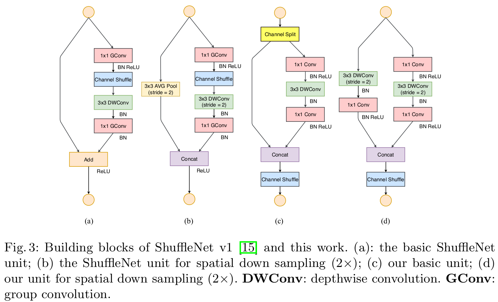

# 轻量化网络
* [**SqueezeNet**](#squeezenet)(2016.2)
* [**MobileNets**](#mobilenets)(2017.4)
* [**MobileNet-V2**](#mobilenet_v2)(2018.1)
* [MnasNet](#mnasnet)(2018.7)
* [**MobileNet-V3**](#mobilenet_v3)(2019.5)
* [**ShuffleNet**](#shufflenet)(2017.7)
* [**ShuffleNet-V2**](#shufflenet_v2)(2018.7)
* [IGCNets](#igcnets)(2017.7, 2018.4, 2018.6)
* [**CondenseNet**](#condensenet)(2017.11)

------
### SqueezeNet
[SqueezeNet](https://arxiv.org/abs/1602.07360)
使用[AlexNet](#alexnet)1/50的参数，实现了近似的准确率。

  
#### 主要创新点
* Fire Module
    * squeeze层，大幅度减小feature map的数量
    * expand层，使用更小的卷积核：使用1\*1的卷积核替换掉部分3\*3的卷积核
* 推迟降采样：大的feature map有助于提升分类的准确率

[返回顶部](#轻量化网络)

------
### MobileNets
[MobileNets](https://arxiv.org/abs/1704.04861)
基于深度可分离卷积构建了一种轻量化网络。据说本文成果早于[ResNet](#resnet)，故网络结构比较简单。

#### 主要创新点
* 利用深度可分离卷积，减少了计算量的同时也降低了参数量
* 将计算和参数的大部分转移到优化做的比较好的1\*1卷积

[返回顶部](#轻量化网络)

------
### MobileNet_V2
[MobileNet_V2](https://arxiv.org/abs/1801.04381)
是对[MobileNets](#mobilenets)的改进，保留了其简单性并显着提高了其准确性。

#### MobileNetV1与V2的微结构对比
* DW之前多了一个1\*1的“扩张”层，目的是提升通道数，以便获得更多特征；
* 为防止Relu破坏特征，使用Linear代替。
  
#### ResNet与MobileNetV2的微结构对比
* ResNet: 压缩 -> 卷积提特征 -> 扩张
* MobileNetV2: 扩张 -> 卷积提特征 -> 压缩

#### 主要创新点
* 线性瓶颈(Linear Bottlenecks): 参考MobileNetV1与V2的微结构对比，
为防止Relu破坏特征，最后一层的ReLu6被替换成了Linear层。
* 倒残差结构(Inverted residuals): 参考ResNet与MobileNetV2的微结构对比，
中间3\*3的卷积层使用更多的通道数，以便获得更多特征。

[返回顶部](#轻量化网络)

-----
### MnasNet
[MnasNet](https://arxiv.org/abs/1807.11626)

[返回顶部](#轻量化网络)

-----
### MobileNet_V3
[MobileNet_V3](http://xxx.itp.ac.cn/abs/1905.02244)

[返回顶部](#轻量化网络)

------
### ShuffleNet
[ShuffleNet](https://arxiv.org/abs/1707.01083)
利用逐点分组卷积和通道重排技术，在保持准确率的前提下极大地减少计算量。 

#### channel shuffle

#### ShuffleNet Units

#### 主要创新点
* 分组逐点卷积(pointwise group convolution): 把bottleneck中的1\*1卷积换成分组卷积，
因为在Xception、ResNeXt、MobileNet等模型中，逐点卷积成为了新的计算瓶颈。
* 通道重排(channel shuffle): 引入组间信息交换的机制，以解决分组卷积中信息不流通的问题。
* 修改了bottleneck中stride=2的层(ShuffleNet Units: C)
    * kernel_size 从1改成3
    * sum改成Concat

[返回顶部](#轻量化网络)

-----
### Shufflenet_v2
[Shufflenet_v2](https://arxiv.org/abs/1807.11164)
认为高效的网络应该直接在目标平台上评估速度而不是计算模型的FLOPs, 
并提出了高效的网络设计应遵循的4条指导原则.进而设计了ShuffleNet-V2.

#### 主要创新点
* 指出了轻量化网络设计不能只考虑计算复杂度(FLOPs), 
还需要考虑存储器访问成本和目标平台特性等其他因素.
* 原则1: Equal channel width minimizes memory access cost (MAC).
卷积前后通道个数相等时, 速度最快.
* 原则2: Excessive group convolution increases MAC.
组卷积降低了FLOPs但提高了MAC.
* 原则3: Network fragmentation reduces degree of parallelism.
多路结构经常造成网络的碎片化, 这虽然有利于提高模型的精确度,
但在GPU上会降低模型的运行速度(CPU上影响较小).
* 原则4: Element-wise operations are non-negligible.
ReLU, AddTensor, AddBias等Element-wise operations的MAC/FLOPs很大.
* 在上述原则的指导下, 设计了"channel split"和shuffleNet-V2.
shuffleNet-V2还借鉴了DenseNet中的re-use结构.
[返回顶部](#轻量化网络)

------
### IGCNets
[IGCNets](https://arxiv.org/abs/1707.02725)
论文中提出了一种全新的通用卷积神经网络交错组卷积（Interleaved Group Convolution，简称 IGC）模块，
解决了神经网络基本卷积单元中的冗余问题，可以在无损性能的前提下，缩减模型、提升计算速度，
有助于深度网络在移动端的部署。  
[IGCV2](https://arxiv.org/abs/1804.06202)
是IGC-V1的一个推广和泛化，将V1的两个结构稀疏的卷积核矩阵的乘积，
推广为多个结构稀疏的卷积核矩阵的乘积，从而进一步了消除冗余性。  
[IGCV3](https://arxiv.org/abs/1806.00178v1)
融合了IGC和bottleneck modules(低秩kernel)的优点, 又进一步提升了性能。

作者给出了IGCV3的mxnet[代码](https://github.com/homles11/IGCV3)

#### 交错组卷积

* 第二次组卷积过程中，每组的输入通道均来自于第一次组卷积过程中不同的组，以达到交错互补的目的。
* 第一次组卷积的kernel_size=3,第二次组卷积的kernel_size=1.
* M=2,即第一个组卷积，每组有2个featureMap时，效果最好。
* IGC + BN + ReLU

#### 交错结构稀疏卷积

* W代表分组卷积; P代表通道重排序
* 第一次组卷积的kernel_size=3,第二次和第三次组卷积的kernel_size=1.
* 将V1中的第二个组卷积分解

#### 交错低秩组卷积

* Conv1: kernel_size=1, group=2, 升维
* Conv2: kernel_size=3, group=channel
* Conv3: kernel_size=1, group=2, 降维

#### 主要创新点
* 交错组卷积(Interleaved Group Convolution)
* 交错结构稀疏卷积(Interleaved Structured Sparse Convolution)
    * 互补条件: 分组卷积的同一个分支中的通道分别在另一个分组卷积的不同分支中。
    * 平衡条件: 每个结构稀疏的的每个分支的通道数需要尽可能相等。
* 交错低秩组卷积(Interleaved Low-Rank Group Convolutions)
* 深层网络可以删除block中间的ReLU层，浅层网络建议保留。

[返回顶部](#轻量化网络)

------
### CondenseNet
[CondenseNet](https://arxiv.org/abs/1711.09224)
优化了DenseNet网络，通过训练时剪枝以及分组卷积提高了计算效率及参数利用率。作者提供了
pytorch的[源码](https://github.com/ShichenLiu/CondenseNet)

#### 自学习分组卷积

#### 主要创新点
* 自学习分组卷积(Learned Group Convolutions)：
训练时剪枝（稀疏正则化），测试时使用使用分组卷积。
训练和测试时过程参考[LGR](#自学习分组卷积)。
* 完全密集连接：特征图大小不同时，使用average pooling
* 增长率随着特征图变小而指数递增：高层的卷积层更依赖于中高层的特征，较少依赖于底层的特征。

[返回顶部](#轻量化网络)